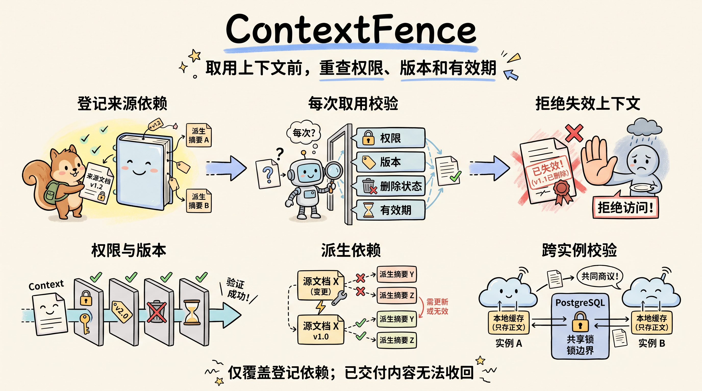

# ContextFence

### 在 Agent 取用前检查上下文有效性的 Java 后端

**把受控上下文及其登记的派生内容绑定到当前权限、来源版本和有效期。每次取用都重新检查，即使另一台服务实例已经缓存了正文。**

[English](README.md) | 中文

[快速开始](#快速开始) · [功能](#功能) · [本地运维](#本地运维) · [验证结果](#验证结果) · [文档](#文档)


*架构示意：来源更新与上下文取用共用 PostgreSQL 锁边界。这是流程图，不是运行截图。*



*概念示意：漫画解释上下文失效过程，不是运行栈截图。*

Alice 读取了一份报价政策，受信生产者登记了依赖它的摘要，实例 A 缓存了摘要。管理员通过实例 B 撤销 Alice 的权限。撤权成功确认后，通过任一实例发起的新取用都会拒绝该摘要。重新授权也不会让旧上下文复活，因为它绑定的授权 epoch 已经失效。

## 功能

- **每次取用验证当前状态：** 向主库检查来源权限、正文版本、授权 epoch、删除状态及有效期。
- **登记派生依赖：** 派生条目继承父项的叶子来源集合及最早到期时间。来源改变后，旧派生项在下一次取用时失效。
- **双实例一致性：** 共享读锁与来源更新排他锁定义撤权边界；正文缓存不保存放行决定。
- **可恢复来源事件：** 完整快照使用单调序号与规范化 hash；相同事件重放返回原结果，同序号异参返回 409。
- **批次全有或全无：** 有效与失效条目混合时不返回任何正文。决策记录只保存元数据和原因，不存来源正文或凭据。
- **本地运维栈：** HAProxy 统一代理两实例，Prometheus、Grafana、Alertmanager 和 PostgreSQL/主机 exporter 提供本地监控。启动与恢复在安全检查后开放入口，发布验收候选实例后恢复其流量，备份校验快照后才发布。

项目提供 HTTP API、合成夹具、双实例脚本和故障实验，无需模型 API Key。它不调用模型，不提供聊天界面、Agent 循环或向量搜索。

## 快速开始

在仓库根目录运行，需要 Python 3、Linux Docker Engine 和 Docker Compose 插件。Windows 可使用连接 WSL Linux 引擎的 Docker CLI，或直接在 WSL 内执行 Linux 命令。首次启动需要访问固定摘要的基础镜像和官方 Grafana 12.2.0 发行包；`start.py` 会自动下载、核对发行包大小与 SHA-256、构建 Grafana 并登记不可变镜像 ID。

Linux/WSL 下频繁读写文件时，建议将仓库克隆到 Linux home 目录的本地文件系统，可参考 Docker 的 [WSL bind mount 指南](https://docs.docker.com/desktop/features/wsl/best-practices/)。当前 bench 在 WSL/Linux ext4 上运行，较早 Windows 挂载目录阶段的失败证据单独保留；迁移本身不证明那些失败的根因或容量改善。

```powershell
# Windows PowerShell
python scripts/start.py
python scripts/ops_smoke.py --instance both
# 运行期间查看 Prometheus 和 Grafana
python scripts/stop.py
```

```bash
# Linux / WSL
python3 scripts/start.py
python3 scripts/ops_smoke.py --instance both
# 运行期间查看 Prometheus 和 Grafana
python3 scripts/stop.py
```

启动会在已忽略的 `.env`、`.local/identities.json` 与 `.local/secrets` 中生成或保留随机本地凭据。流程先关闭持久入口，再独立运行迁移与数据库角色权限检查，验收两个 API 实例后才开放流量。停止保留数据库卷、备份和凭据。

| 本地入口 | 用途 |
| --- | --- |
| [127.0.0.1:58090](http://127.0.0.1:58090) | 经 HAProxy 的统一业务入口 |
| [127.0.0.1:59090](http://127.0.0.1:59090) | Prometheus 抓取目标、指标和告警 |
| [127.0.0.1:53000](http://127.0.0.1:53000) | 已配置的 Grafana 面板；用户 `operator`，密码保存在 `.local/secrets/grafana-admin` |

三个宿主机入口均只绑定回环地址。API A/B 与 PostgreSQL 无宿主机业务端口。当前 Compose 工作流使用统一入口；旧 `demo.py` 直接访问 JVM 的默认端口仅用于历史验证记录中的运行方式。

显式双实例烟测先预热缓存，再检查撤权、旧授权 epoch、租户隔离、相同事件重放和同序号冲突。输出位于 `artifacts/local/ops-smoke.json`，只含决策，不含受保护正文或凭据。维护状态与诊断步骤见[本地运行手册](docs/operations/runbook.md)。

## 本地运维

以下命令均在仓库根目录执行；Linux/WSL 使用 `python3`，Windows 使用 `python`：

- **发布候选版本**：运行 `python3 scripts/deploy.py`，完成测试、构建、迁移与发布。先阅读[发布与回滚](docs/operations/runbook.md#发布与回滚)，并安装下文的构建与测试工具。
- **创建经过校验的快照备份**：运行 `python3 scripts/backup.py`；见[数据库备份与安全恢复](docs/operations/recovery.md)。
- **每小时尝试备份**：保持 `python3 scripts/backup_scheduler.py` 在前台运行，并核对备份指标。
- **执行完整恢复演练**：在独立项目中，或准备覆盖全部来源的可信账本后，运行 `python3 scripts/restore_demo.py`。先阅读[恢复前提与安全验收](docs/operations/recovery.md)。
- **复现容量与故障实验**：按[容量与故障验证方法](docs/operations/capacity-method.md)固定环境、保存证据，并遵守正式时间窗口与对照规则。

发布记录实际镜像 ID，逐个排空、更新和验收实例；失败时经安全检查恢复上一镜像。数据库 schema 不随镜像回滚。备份保持 PostgreSQL 导出快照事务存活，校验 custom archive 后才发布。恢复使用新数据库卷、当前身份配置和完整独立来源账本，并保留故障源卷。脚本与方法是本地操作工具，其存在不代表发布、恢复和容量验收全部通过。

## 构建与测试

本机构建需要 JDK 21 与 Maven 3.6.3+。默认集成测试通过 Testcontainers 启动 PostgreSQL，需要正常工作的 Docker 引擎。

```powershell
.\scripts\maven.ps1 verify
python -m unittest discover -s scripts/tests -v
```

```bash
mvn verify
python3 -m unittest discover -s scripts/tests -v
```

也可使用名称以 `_test` 结尾的独立真实 PostgreSQL 测试库。在本地环境设置以下变量，并替换占位符：

```powershell
$env:TEST_DATABASE_URL='jdbc:postgresql://127.0.0.1:5432/contextfence_test'
$env:TEST_DATABASE_USER='your_test_user'
$env:TEST_DATABASE_PASSWORD='your_test_password'
.\scripts\maven.ps1 verify
python -m unittest discover -s scripts/tests -v
```

```bash
export TEST_DATABASE_URL='jdbc:postgresql://127.0.0.1:5432/contextfence_test'
export TEST_DATABASE_USER='your_test_user'
export TEST_DATABASE_PASSWORD='your_test_password'
mvn verify
python3 -m unittest discover -s scripts/tests -v
```

测试使用随机租户，会在测试库留下合成数据，不会删除数据库。没有 PostgreSQL 时测试明确失败，不以 H2 替代，也不静默跳过集成检查。

仅打包可运行 `mvn -DskipTests package`，PowerShell 对应 `.\scripts\maven.ps1 '-DskipTests' package`，产物为 `target/context-fence.jar`。原生运行时设置 `CONTEXTFENCE_DATABASE_URL`、`CONTEXTFENCE_DATABASE_USER`、`CONTEXTFENCE_DATABASE_PASSWORD` 与 `CONTEXTFENCE_IDENTITIES_FILE`，再运行 `java -jar target/context-fence.jar`。第二个进程使用不同 `SERVER_PORT`，连接同一数据库和身份映射。实际凭据保存在忽略的本地配置或环境变量中。[API 文档](docs/api.md)提供请求结构与错误语义。

## 验证结果

2026-10-05 的本地 SRE 记录使用 WSL 中的 Ubuntu 24.04.3 LTS、Docker Engine 29.1.3 与 Compose 2.40.3，完整 Compose 栈和默认的官方 Grafana 发行包校验启动分支已实际运行。旧 Docker API HTTP 500 限制属于下方历史记录。

本次交付覆盖已实测的本地部署、权限、监控、故障演练、回滚、安全数据库恢复，以及容量预探测和实验档位冻结。36 项正式容量矩阵、9 项对照、更长时间连续观察和云部署列为后续验证；当前不发布通过正式容量验收的结果。

| 验证项 | 当前已观察结果 |
| --- | --- |
| Java `verify` 与运行镜像溯源 | 77 项通过：32 单元 + 45 集成；无失败、错误或跳过。运行镜像全部 71 个生产 class 与实际受测 class 逐字节一致 |
| 最终 Python 脚本回归 | 两平台各发现 243 项：Windows Python 3.9.25 为 242 通过 / 1 项 POSIX 跳过；Linux Python 3.12.3 为 234 通过 / 9 项 Windows 专属跳过；无失败或错误 |
| 主 Compose 栈 | 两实例安全烟测通过；Prometheus 6 个抓取目标均正常；实际快照备份通过 |
| API A/B 进程终止演练 | 均满足 HAProxy 15 秒摘除和 60 秒告警目标：A 为 8.418 / 47.316 秒；B 为 9.348 / 41.569 秒 |
| 数据库网络断连 | v5 通过：切断 13 条既有连接并证明新连接拒绝；两实例预热取用均为 503、无正文；实际收到 firing/resolved |
| 坏版本发布与回滚 | 真实 `scripts/deploy.py` 管线的故障验收通过：118.395 秒发现 ready 失败（预算 120 秒），201.782 秒接受回滚（预算 300 秒）；整个演练耗时 681.265 秒 |
| 独立新卷恢复 | 通过：RTO 44.006 秒，故障时快照年龄 21.684 秒。5 个已确认 context 丢失 1 个，8 条 receipt 丢失 4 条；6 条 source_event 缺失的 3 条由独立账本重建，未恢复原应用时间 |
| 混版本安全 | 实际旧二进制通过撤权、重授、幂等、冲突及回滚检查；恢复后拒绝尚未过期的旧来源/派生上下文、轮换前 token 和混合批次部分结果 |
| 受控指标告警交付 | unsafe-input、非预期结果与备份年龄告警的实际 Prometheus → Alertmanager → receiver firing/resolved 通过；输入为合成指标，未观察到服务实际错误放行 |
| 有界磁盘告警演练 | v2 通过：在专属 ext4 loop 文件系统实际填充 89,920,512 字节，剩余约 14.9972%；`HostDiskLow` firing/resolved 实际交付。清理通过，128 MiB 镜像保留 |
| 持续连接池等待告警 | v2 通过：故障率、池等待、池超时和尾延迟四类告警实际 firing/resolved，最终两个告警平台全部状态清空；首轮恢复验收失败保留 |
| 有界运行日志检查 | 捕获 8,070 行、5,075 条合法结构化请求记录，无非法请求记录或重复请求 ID；一般诊断 SQL/数据库 URL 仍存在于私有日志，整体隐私检查失败，故障窗口起点未覆盖 |
| 04:57 UTC 的容量预检 | 通过：仅 10 个 bench 容器运行，6 个监控目标正常，两实例实际连接池上限均为 16，4 项数据库角色检查通过；Java 子进程 RSS 从实际进程状态读取 |
| 实际调度快照备份 | 当前 ext4 环境已有四份实际调度归档核验通过，快照间隔为 3,697.525889 / 3,680.996285 / 3,667.114568 秒；只证明这些调度尝试和归档有效，不证明精确每小时或全程一小时 RPO |
| 开发短测 | 首轮失败：101 issued，旧分类为 44 success / 57 unexpected，业务 HTTP 全部 200。v2 于 05:29 UTC 通过：100 issued / 100 success，请求计数严格对应，3 个资源样本观察到约五秒间隔；首轮失败保留 |
| 正式探测 v1 | 失败且未完成，进程退出 1：hot10 的 600 次业务请求成功，但结果计数导出失败；hot25 有 912 次超时、93 次客户端失败、120 次 dropped iterations 和 feeder 失败；hot50 初始 seed 失败，未冻结容量 |
| HAProxy 配置受控应用 | 05:53 UTC 通过：实际版本 3.2.6，两个进程各一线程，镜像与 CPU/内存限制不变；关闭入口时 503、双实例权限烟测、4 项角色检查及 6 个监控目标通过；容量效果与根因尚未证明 |
| 当前 Linux 文件系统 bench | 06:09 UTC 完整启动通过，06:11 预检通过：10 个 bench 容器、6 个目标、连接池上限 16/16、4 项角色及真实 Java 子进程 RSS；开发短测 v3 为 101 success，unsafe/drop/采样错误均 0，read/write 三计数一致，3 个样本间隔中位数 / 最大值为 5.485785 / 5.971443 秒 |
| 完整冻结前探测 v5 | hot/single/multi × 10/25/50/100/200 RPS 共 15 项的原始请求、完成时间和资源检查通过；业务错误、unsafe、drop、feeder、导出与采样错误均 0；每项预热 30 秒、测量 60 秒 |
| 追加 400 RPS 探测 | 三项均完成但均不具容量验收资格；single 有 324 次非预期响应 / 23,693 次已发请求（1.36749%）、308 次 drop、PG CPU 均值 97.34%、持续锁等待首尾 17→24.5；hot/multi 另保留客户端、feeder 与资源异常 |
| 09:15 UTC 实际冻结 | 低档 / 额定档 / 过载观察档为 25/200/400 RPS，回归上限为 p95 18 ms / p99 102 ms；72 份原始请求、资源和元数据文件摘要复核通过，实际 p99 指标读回为 0.102 秒；正式 36 + 9 项列为后续验证 |

最终 Python 检查分别于 2026-10-05 Windows 10:10:16.844681 UTC、Linux 10:13:39.693288 UTC 完成，使用同一份前后未变源码，摘要为 [验证记录中的同一摘要](docs/validation.md)；约 07:31 UTC 的 216 项结果在[运行证据](docs/operations/runtime-evidence.md#历史脚本验证点)中按日期保留为历史。后续源码改动须有新的回归记录。JavaScript 契约使用 Windows Node v24.15.0，Linux Python 运行通过 WSL interoperability 调用该 Node；未验证原生 Linux Node。五秒 RSS 命令时限与统一完成时间已在完整 v5 探测中实际运行验证。公共追加探测的 merge 入口已对既有 18 项观察实际执行通过，保留 400 RPS 失败结果，没有重跑负载。告警 mock 与纯报告生成器 guard 检查各自保留代码验证范围，不能证明真实告警交付或正式容量报告完成。

较早 v1/v2 失败或未完成记录、v3 RSS 读取失败以及 v4 的 15 项完成时间不一致均保留。WSL/Linux ext4 bench 实际观察到 20 CPUs、8,162,697,216 字节（7.602104 GiB）虚拟机内存，未同时运行第二套服务栈。v5 与追加 400 RPS 探测支持冻结实验档位，不构成最大容量结论。36 项容量矩阵（6 小时 54 分钟）、9 项单变量对照（2 小时 15 分钟）与更长时间备份观察均列为后续验证；当前未公布通过验收的正式容量结果。故障资源记录保留采样缺口，恢复未宣称零丢失。详见[当前验证记录](docs/validation.md)、[脱敏运行证据](docs/operations/runtime-evidence.md)、[数据库断连复盘](docs/operations/postmortem-db-disconnect.md)和[容量方法](docs/operations/capacity-method.md)。

bench 于 10:17 UTC 的最终交接通过：专属调度器已停止，运行容器为 0，两层入口关闭，数据库卷保留。主栈与独立恢复栈也维持停止，卷及凭据保留。恢复后的启动路径修复已通过代码检查，真实恢复后 stop→start 列为后续验证。这些本地结果不构成生产高可用、云部署、CI/CD 或异地容灾验收。有界运行日志的隐私检查仍为失败，原始诊断日志只保存在本地忽略目录。

保留的 **2026-09-29 历史 Windows 记录**使用 OpenJDK 21.0.1、Maven 3.8.5 与 PostgreSQL 17.11：

| 验证项 | 实测结果 |
| --- | --- |
| Java `verify` | 39 项通过：9 单元 + 30 集成；无失败、错误或跳过 |
| 两独立 JVM 的 HTTP 演示 | 83 次 HTTP 观察断言通过；撤权确认后 50/50 并发取用返回 403，且无正文 |
| 确定性并发与进程终止 | 7 项实验通过，包含真实数据库锁阻塞与已预热缓存 |
| Python 脚本检查 | 16 项通过；1 项 POSIX 权限检查在 Windows 明确跳过 |

这些数字是可复现的本地观察，不代表生产吞吐。[验证记录](docs/validation.md)区分当前与历史范围；[保存的 HTML 报告](docs/reports/report.html)属于 2026-09-29 的 JVM 运行，不作为当前运维栈的证据。

## 保证与限制

**撤权成功确认后新发起的取用会被拒绝。** 与撤权重叠、先获得共享锁的请求允许完成，其响应可能晚于确认到达。期限以取得锁后采样的数据库时间判断，不以响应到达时间判断。

已经送给客户端或模型的数据无法撤回。依赖由受信生产者登记，系统不能从任意文本证明其完整语义来源。上游变化提交为本服务的来源快照后才受保证；`fresh_until` 限制已知状态的年龄，不代表连接器实时同步。逻辑删除阻止后续取用，不认证数据库历史、缓存及备份的物理擦除。

首版采用单主库、租户级锁和有界逐项元数据查询，没有高吞吐承诺。身份 token 映射用于本地演示；生产身份提供商、资料连接器及保留策略需要另行接入。

两个 API 实例共享一个 PostgreSQL，HAProxy、数据库和 Docker 宿主机仍是单点。本地故障切换观察不证明生产高可用或异机容灾。

## 文档

- [API 与错误语义](docs/api.md)
- [架构与并发边界](docs/architecture.md)
- [问题依据与一手来源](docs/rationale.md)
- [验证结果与复现](docs/validation.md)
- [本地启动、维护、监控与发布手册](docs/operations/runbook.md)
- [数据库备份与安全恢复](docs/operations/recovery.md)
- [当前实测运行证据与限制](docs/operations/runtime-evidence.md)
- [数据库网络断连演练复盘](docs/operations/postmortem-db-disconnect.md)
- [容量、优化对照与故障验证方法](docs/operations/capacity-method.md)
- [工程讲解与取舍](docs/interview.md)
- [历史双实例实验报告（2026-09-29）](docs/reports/report.html)

Java 21 · Spring Boot 4.1.1 · Spring Security/JDBC · PostgreSQL 17 · Flyway · Caffeine · JUnit 5 · Testcontainers
