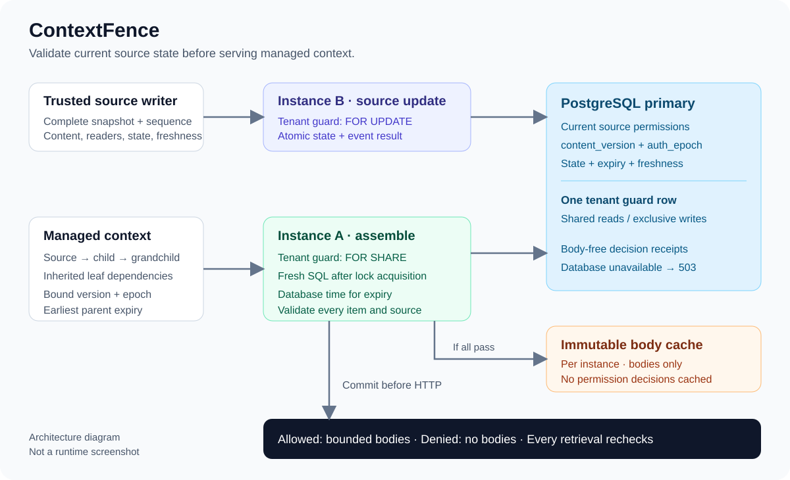

# ContextFence

### 在 Agent 取用前检查上下文有效性的 Java 后端

**把受控上下文及其登记的派生内容绑定到当前权限、来源版本和有效期。每次取用都重新检查，即使另一台服务实例已经缓存了正文。**

[English](README.md) | 中文

[快速开始](#快速开始) · [功能](#功能) · [验证结果](#验证结果) · [文档](#文档)



*架构示意：来源更新与上下文取用共用 PostgreSQL 锁边界。这是流程图，不是运行截图。*

Alice 读取了一份报价政策，受信生产者登记了依赖它的摘要，实例 A 缓存了摘要。管理员通过实例 B 撤销 Alice 的权限。撤权成功确认后，通过任一实例发起的新取用都会拒绝该摘要。重新授权也不会让旧上下文复活，因为它绑定的授权 epoch 已经失效。

## 功能

- **每次取用验证当前状态：** 向主库检查来源权限、正文版本、授权 epoch、删除状态及有效期。
- **登记派生依赖：** 派生条目继承父项的叶子来源集合及最早到期时间。来源改变后，旧派生项在下一次取用时失效。
- **双实例一致性：** 共享读锁与来源更新排他锁定义撤权边界；正文缓存不保存放行决定。
- **可恢复来源事件：** 完整快照使用单调序号与规范化 hash；相同事件重放返回原结果，同序号异参返回 409。
- **批次全有或全无：** 有效与失效条目混合时不返回任何正文。决策记录只保存元数据和原因，不存来源正文或凭据。

项目提供 HTTP API、合成夹具、双实例脚本和故障实验，无需模型 API Key。它不调用模型，不提供聊天界面、Agent 循环或向量搜索。

## 快速开始

在仓库根目录运行。容器方式需要 Docker Engine/Desktop、Docker Compose 插件和 Python 3；首次构建需要网络。

```powershell
# Windows PowerShell
.\scripts\start.ps1
python scripts/demo.py
python scripts/report.py
# 打开 artifacts/local/report.html
.\scripts\stop.ps1
```

```bash
# macOS / Linux
bash scripts/start.sh
python3 scripts/demo.py
python3 scripts/report.py
# 打开 artifacts/local/report.html
bash scripts/stop.sh
```

启动脚本会在 `.env` 与 `.local/identities.json` 生成随机本地凭据，重复启动保留凭据和数据库。默认仅监听回环地址：API A 为 `58091`，API B 为 `58092`，PostgreSQL 为 `55448`；端口可在 `.env` 修改。停止脚本保留数据库卷。

每次演示创建新的合成资源，先预热两实例缓存，再撤权，检查确认后发起的 50 个并发取用；还覆盖重新授权、来源更新、删除、到期、租户隔离与混合批次。生成的报告仅包含决策元数据，不包含受保护正文。

**容器验证存在限制：** 本次记录环境的 Docker Engine API 返回 HTTP 500。Compose 配置已检查，但镜像构建、容器启动及 Testcontainers 启动分支没有实测。后端运行记录来自两个独立 JVM 与真实 PostgreSQL 17.11。详见[验证说明](docs/validation.md)。

## 构建与测试

本机构建需要 JDK 21 与 Maven 3.6.3+。默认集成测试通过 Testcontainers 启动 PostgreSQL，需要正常工作的 Docker 引擎。

```powershell
.\scripts\maven.ps1 verify
python -m unittest discover -s scripts/tests -v
```

```bash
mvn verify
python3 -m unittest discover -s scripts/tests -v
```

也可使用名称以 `_test` 结尾的独立真实 PostgreSQL 测试库。在本地环境设置以下变量，并替换占位符：

```powershell
$env:TEST_DATABASE_URL='jdbc:postgresql://127.0.0.1:5432/contextfence_test'
$env:TEST_DATABASE_USER='your_test_user'
$env:TEST_DATABASE_PASSWORD='your_test_password'
.\scripts\maven.ps1 verify
python -m unittest discover -s scripts/tests -v
```

```bash
export TEST_DATABASE_URL='jdbc:postgresql://127.0.0.1:5432/contextfence_test'
export TEST_DATABASE_USER='your_test_user'
export TEST_DATABASE_PASSWORD='your_test_password'
mvn verify
python3 -m unittest discover -s scripts/tests -v
```

测试使用随机租户，会在测试库留下合成数据，不会删除数据库。没有 PostgreSQL 时测试明确失败，不以 H2 替代，也不静默跳过集成检查。

仅打包可运行 `mvn -DskipTests package`，PowerShell 对应 `.\scripts\maven.ps1 '-DskipTests' package`，产物为 `target/context-fence.jar`。原生运行时设置 `CONTEXTFENCE_DATABASE_URL`、`CONTEXTFENCE_DATABASE_USER`、`CONTEXTFENCE_DATABASE_PASSWORD` 与 `CONTEXTFENCE_IDENTITIES_FILE`，再运行 `java -jar target/context-fence.jar`。第二个进程使用不同 `SERVER_PORT`，连接同一数据库和身份映射。实际凭据保存在忽略的本地配置或环境变量中。[API 文档](docs/api.md)提供请求结构与错误语义。

## 验证结果

保存的 Windows 运行记录使用 OpenJDK 21.0.1、Maven 3.8.5 与 PostgreSQL 17.11：

| 验证项 | 实测结果 |
| --- | --- |
| Java `verify` | 39 项通过：9 单元 + 30 集成；无失败、错误或跳过 |
| 两独立 JVM 的 HTTP 演示 | 83 次 HTTP 观察断言通过；撤权确认后 50/50 并发取用返回 403，且无正文 |
| 确定性并发与进程终止 | 7 项实验通过，包含真实数据库锁阻塞与已预热缓存 |
| Python 脚本检查 | 16 项通过；1 项 POSIX 权限检查在 Windows 明确跳过 |

这些数字是可复现的本地观察，不代表生产吞吐。范围和证据见[验证记录](docs/validation.md)与[保存的 HTML 报告](docs/reports/report.html)。

## 保证与限制

**撤权成功确认后新发起的取用会被拒绝。** 与撤权重叠、先获得共享锁的请求允许完成，其响应可能晚于确认到达。期限以取得锁后采样的数据库时间判断，不以响应到达时间判断。

已经送给客户端或模型的数据无法撤回。依赖由受信生产者登记，系统不能从任意文本证明其完整语义来源。上游变化提交为本服务的来源快照后才受保证；`fresh_until` 限制已知状态的年龄，不代表连接器实时同步。逻辑删除阻止后续取用，不认证数据库历史、缓存及备份的物理擦除。

首版采用单主库、租户级锁和有界逐项元数据查询，没有高吞吐承诺。身份 token 映射用于本地演示；生产身份提供商、资料连接器及保留策略需要另行接入。

## 文档

- [API 与错误语义](docs/api.md)
- [架构与并发边界](docs/architecture.md)
- [问题依据与一手来源](docs/rationale.md)
- [验证结果与复现](docs/validation.md)
- [工程讲解与取舍](docs/interview.md)
- [双实例实验报告](docs/reports/report.html)

Java 21 · Spring Boot 4.1.1 · Spring Security/JDBC · PostgreSQL 17 · Flyway · Caffeine · JUnit 5 · Testcontainers
